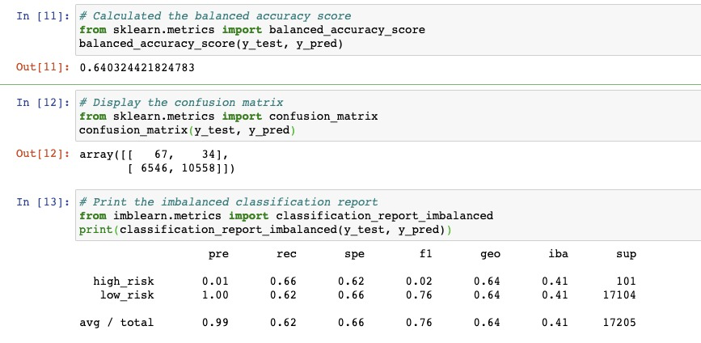
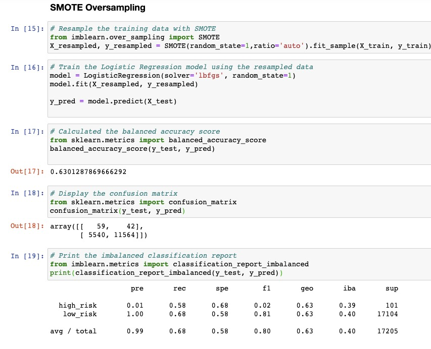
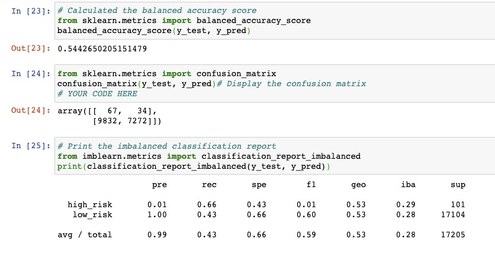
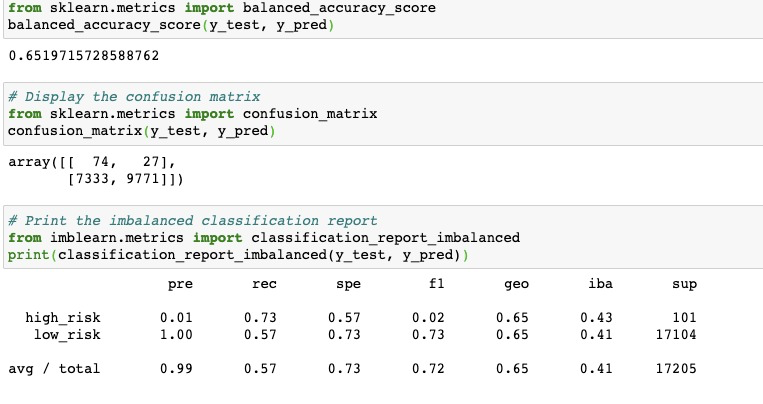
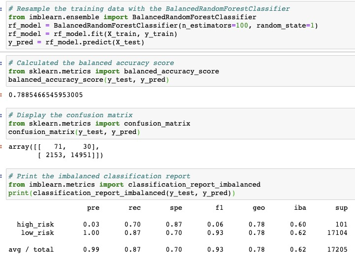
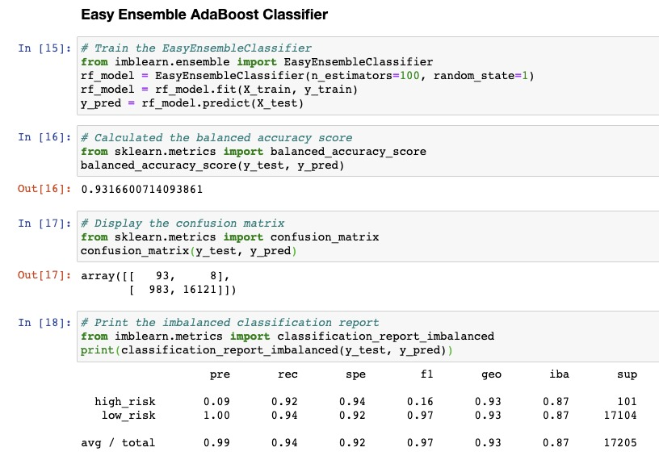

# Credit Risk Analysis

## Overview of the analysis:
The goal of this analysis is to predict credit risk. We will evaluate three machine learning models by using resampling to determine which is better at predicting credit risk. First, you’ll use the oversampling RandomOverSampler and SMOTE algorithms, and then you’ll use the undersampling ClusterCentroids algorithm. Using these algorithms, you’ll resample the dataset, view the count of the target classes, train a logistic regression classifier, calculate the balanced accuracy score, generate a confusion matrix, and generate a classification report.

## Results: 

The basic first step is to read in our data using pandas library and split into train and test set. Our target variable which is Y is “loan status”

We then begin test with our different models once we have our dataset prepared

### Naive Random Over Sampling
Using the naïve random sampling and SMOTE algorithm, we got 64% accuracy score, precision rate was 1percent and recall rat at 66

### SMOTE Oversampling 

Our balanced accuracy score is 63% here, about 1percent less of naïve sampling. We also had similar high-risk precision of 1% and the low risk recall is 68% 

### Cluster Centroids Under sampling
This model produced a lesser accuracy of 54%, which is worse than previous ones as seen above.The precision and recall rates were similar as the above with 1% precision for high risk but the low risk recall score fell to 43%.

### Over and Under Sampling SMOTEEN

Looking at both over and under sampling in a combination. We got 65% accuracy score
The high risk precision score was similar as the other models at 1% and the low risk recall was at 57%. 

### Balanced Random Forest Classifier

This model produced a higher accuracy of 78% versus the rest previously explained so far. Also came with higher precision risk score of 3% and low risk recall also up with 87% and recall score for high risk increased to 70%

###  Easy Ensemble Adaboost Classifier

Here we got the highest accuracy so far with 93% rate
The recall for both low risk and high risk also increased from previous models to 92% and 94% respectively 

## Summary: 
From our analysis, the Easy Ensemble Adaboost Classifier turned out to be the best model to be used to predict credit risk. I will recommend going for this model as it beats all other models in every score rating

